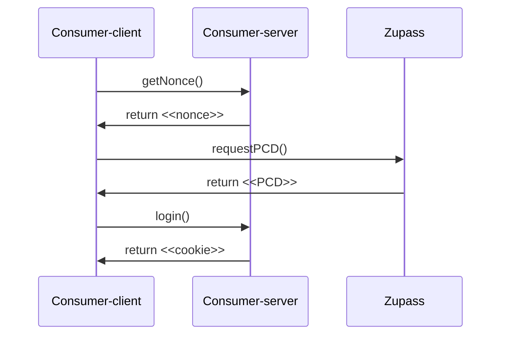

<p align="center">
    <h1 align="center">
        ZuAuthButton
    </h1>
</p>

| A versatile single-click React button for anonymous and non-anonymous authentication on top of EdDSA ticket PCDs. |
| ----------------------------------------------------------------------------------------------------------------- |

### Context

A Proof-Carrying Data (PCD) represents a self-contained data entity that carries all necessary information for verification and interpretation by a consumer. This eliminates the need for continuous exchanges between the issuer and the consumer. This button implements an end-to-end authentication flow on top of [EdDSA tickets PCD](https://github.com/proofcarryingdata/zupass/tree/main/packages/eddsa-ticket-pcd). A PCD ticket represents the purchase of a product associated with one specific event.

The button seamlessly communicates with the server for validation and session management. The session persists even upon page refresh and is terminated when the user logs out. By utilizing Zero-Knowledge Proofs, it becomes possible to create a proof for a ticket and reveal only a specific subset of associated information ([@pcd/zk-eddsa-event-ticket-pcd](https://github.com/proofcarryingdata/zupass/tree/main/packages/zk-eddsa-event-ticket-pcd)). This ensures anonymous authentication, where user-specific details remain confidential. On the other hand, generating a Semaphore signature for a ticket ([@pcd/semaphore-signature-pcd](https://github.com/proofcarryingdata/zupass/tree/main/packages/semaphore-signature-pcd)) enables non-anonymous authentication. 

By integrating and configuring this button component, developers can seamlessly incorporate these advanced authentication mechanisms into their applications to fit their specific needs. 

### Workflow

The sequence diagram below illustrates how the components interact with each other. In summary:

1. The consumer client requests the consumer server to generate a session nonce and to include it within the PCD (the nonce is the watermark and the external nullifier in zk mode).
2. The consumer client opens the Zupass popup to create the PCD.
3. The newly generated PCD is sent to the consumer server to complete the login process.
4. The consumer server validates the PCD and its parameters and generates a user session cookie.
5. The user now has a valid session and can access features reserved for logged-in users.



### Integration

Before integrating the **`ZuAuthButton`** component, it's crucial to have a clear understanding of its general functionality and configuration. This component plays a pivotal role in managing interactions with the server during the authentication process. When clicked, the button triggers authentication flows based on the provided settings, facilitating communication with the server for validation and seamless session management. Depending on the user's authentication status, it offers options to either initiate the authentication process or log out if already authenticated. At the application level, it's mandatory to provide the *current authentication status* (**`authenticated`**) of the user and a corresponding *handler method* (**`setAuthenticated`**) to dynamically toggle the value.

**Properties**

**`ZuAuthButton`** can be customized through the following properties:

- **ticketFieldsToReveal**: the list of ticket fields that must be displayed during anonymous authentication, making them visibile in a proof. For instance, a specific use case may require the **`eventId`**, **`productId`**, and **`attendeeSemaphoreIdentity`** for successful authentication. Conversely, another use case may only necessitate the **`eventId`** associated with the ticket. If left unspecified, complete anonymity is maintained for any valid ticket.
- **validEventIds**: the set of event identifiers that are supported in the authentication process. Any ticket associated with an event having an identifier not present in this list will be rejected and deemed invalid for authentication purposes. This property must have the same length as the **`validProductIds`** property.
- **validProductIds**: the set of product identifiers that are supported in the authentication process. Any ticket associated with a product having an identifier not present in this list will be rejected and deemed invalid for authentication purposes. This property must have the same length as the **`validEventIds`** property..
- **useAnonAuthentication**: a boolean which is **true** when working with a ZK EdDSA event ticket PCD; otherwise **false** when working with Semaphore signature PCD.
- **authenticated**: a boolean to keep track of the current session of the user (**true** when active; otherwise **false**).
- **setAuthenticated**: an handler callback to change the **`authenticated`** boolean value.

**Usage**

To smoothly integrate the **`ZuAuthButton`** into your application workflow, follow these steps:

<!-- 1. Install the component -->
<!-- - If you haven't already, install the **`ZuAuthButton`** component by running the command: **`npm install @pcd/zu-auth-button` -->
1. **Import the Component**
    ```ts
       import ZuAuthButton from "<path-to-zu-auth-button>/ZuAuthButton"
    ```
2. **Manage User Authentication Status**
Define a state variable to handle the user authentication status. The following ensures the persistence of this status even after a page refresh.

    ```tsx
      const [authenticated, setAuthenticated] = useState<boolean>(false);
        const [anonymous, setAnonymous] = useState<boolean>(
          JSON.parse(localStorage.getItem("anonymous"))
        );
    
      useEffect(() => {
          (async function () {
            setAuthenticated(await isAuthenticated());
          })();
        }, []);
    ```
        
3. **Customize Anonymous Authentication**
If you need to configure anonymous authentication (optional), you have to provide the list of ticket fields you’d like to be revealed during the verification process to the server and indicate which events and products should be accepted as valid for the authentication.
            
    ```tsx
        // The code snippet below makes only the **eventId**, **productId**, 
        // and **attendeeSemaphoreIdentity** to be revealed.
        const exampleTicketFieldsToReveal: EdDSATicketFieldsToReveal = {
            revealEventId: true,
            revealProductId: true,
            revealTicketId: true,
            revealAttendeeSemaphoreId: false,
            revealIsConsumed: false,
            revealIsRevoked: false,
            revealTicketCategory: false,
            revealTimestampConsumed: false,
            revealTimestampSigned: false
          };

        // If they are empty, all events and products identifiers are valid.
        const exampleValidTicketsIds: string[] = [];
        const exampleValidProductIds: string[] = [];
    ```

**Example**

We provide **`ZuAuthExample`** as a comprehensive practical way of integrating **`ZuAuthButton`** to implement both anonymous and non-anonymous authentication using EdDSA Ticket PCDs. This example can be used as one-pager boilerplate for implementing your tickets authentication mechanism.

[](https://user-images.githubusercontent.com/11427903/277650245-9d358223-5a52-4579-87d5-73391eb4bddc.webm)

This example allows anyone to authentication with any ticket in their Zupass, giving them the autonomy to choose their preferred authentication method by simply clicking the checkbox. Once authenticated, users can log out and authenticate again with the same ticket, either in the same mode or a different one (e.g., switching from anonymous to non-anonymous). The session and authentication mode choices are preserved even after subsequent page refreshes, thanks to storage in the browser's local storage of the last authentication mode used. 

<!-- Navigate on render -> https://consumer-client.onrender.com/ -->
Assuming you have Zupass correctly configured in your machine and you have issued some tickets, you just need to navigate the [EdDSA Ticket PCD anonymous and non-anonymous authentication from Zupass](http://localhost:3001/#/examples/zu-auth) example.