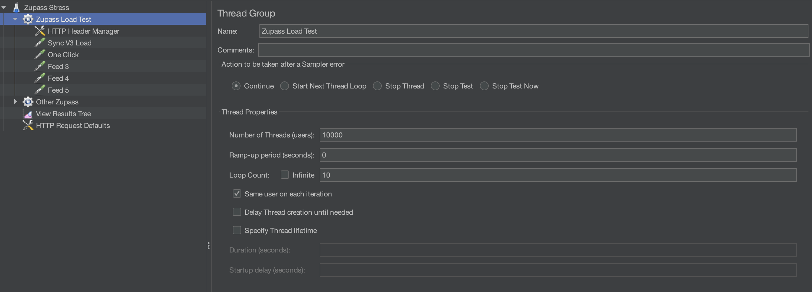

# API Stress Test With JMeter

Step 1 - install JMeter

Step 2 - open JMeter and choose `stress-andrew.jmx`

Step 3 - click on `Zupass Load Test` Thread Group and update number of threads and loop count

Step 4 - click save, open a terminal and run `jmeter -n -t ./stress.jmx -l res.jtl -e -o output`
